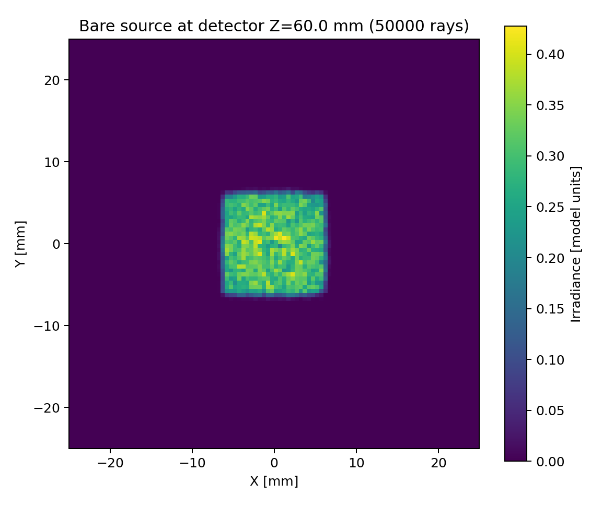
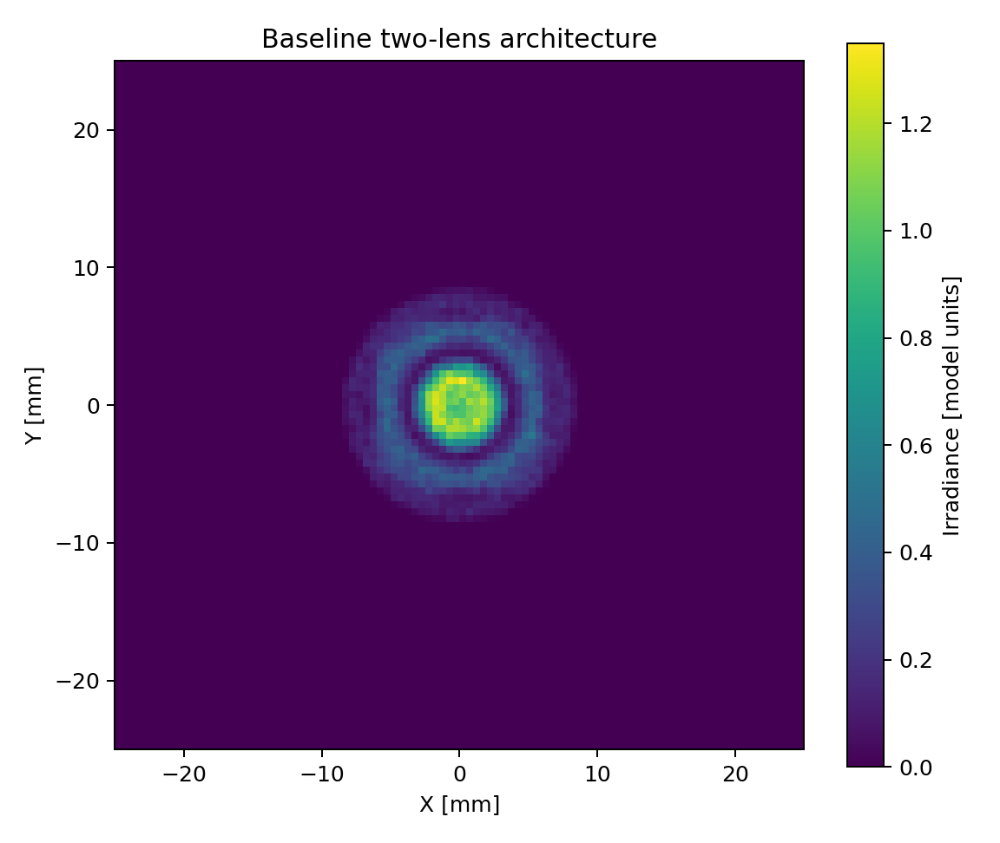
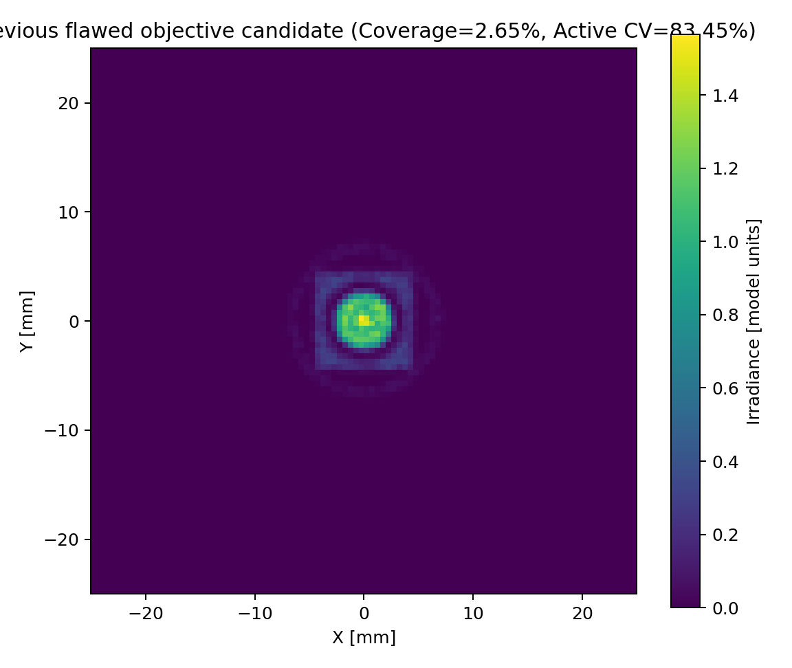
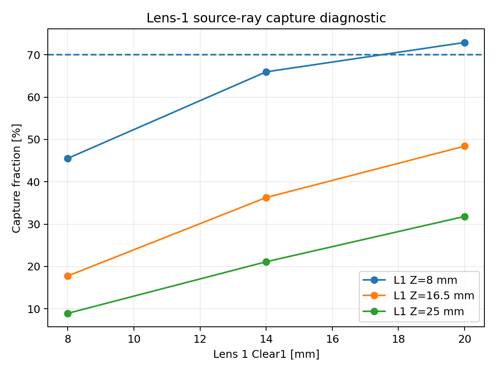

# LED Collimator & Uniform Illumination System

A Zemax OpticStudio NSC study of LED collimation and uniform illumination, combining direct optical-model development with Python/ZOS-API automation and quantitative detector analysis.

## 1. Project objective

The project investigates whether a compact rotationally symmetric lens architecture can collect LED emission and produce broad, uniform illumination over a **50 × 50 mm detector**.

Two Zemax systems were developed:

1. **Baseline single-lens system** — LED source → N-BK7 standard lens → detector.
2. **Two-lens system** — LED source → Lens 1 → Lens 2 → detector.

The actual Zemax `.zos` models are included under [`models/`](models/) so the optical construction can be opened and inspected directly in OpticStudio.

## 2. Result — architecture-limited

The corrected study found that the tested architecture is **capture/coverage-limited**.

| Diagnostic | Corrected result |
|---|---:|
| Minimum Lens-1 capture | **8.9360%** |
| Mean Lens-1 capture | **38.7463%** |
| Required architecture gate | **> 70.0%** |
| Wavelength channels | **1** |
| Detector | **50 × 50 mm** |
| Detector sampling | **100 × 100** |
| Coverage floor | **8.00%** |

Because the Lens-1 capture gate was not satisfied, the planned 21-variable shape optimization was **not run**.

This is the main research result: within the tested rotationally symmetric one-/two-lens architecture and working-distance range, capture limits broad illumination coverage before a large shape optimization becomes meaningful.

## 3. Zemax models

### Baseline single-lens model

[`models/baseline_led_lens.zos`](models/baseline_led_lens.zos)

```text
Source Ellipse
      ↓
N-BK7 Standard Lens
      ↓
50 × 50 mm Detector
```

The baseline model uses the original NSC architecture:

- Source at Z = 0 mm
- Lens at Z = 20 mm
- Detector at Z = 50 mm
- 550 nm wavelength
- 100 × 100 detector pixels

### Two-lens model

[`models/two_lens_led_system.zos`](models/two_lens_led_system.zos)

```text
Source Ellipse
      ↓
Lens 1 — N-BK7
      ↓
Lens 2 — N-BK7
      ↓
50 × 50 mm Detector
```

This model extends the baseline into the two-lens architecture used for the capture diagnostic and planned optimization.

These files demonstrate the actual **OpticStudio NSC model-building work** behind the project, while the Python script demonstrates the automation and analysis layer.

## 4. Workflow

```text
Zemax NSC model
      ↓
Source + optical geometry
      ↓
NSC ray trace
      ↓
Detector irradiance
      ↓
Python / ZOS-API extraction
      ↓
Fixed-grid CV + coverage
      ↓
Capture diagnostic
      ↓
Architecture gate
      ↓
Final architectural conclusion
```

## 5. Corrected methodology

Two CV definitions are deliberately separated:

- **Fixed-region CV:** calculated over the complete 100 × 100 detector grid and used for feasibility/ranking.
- **Active-only CV:** calculated only over pixels above the coverage threshold and retained as a diagnostic.

Coverage uses **10% of peak irradiance**. The peak is calculated as the maximum of a **3 × 3 box-smoothed detector map**, avoiding dependence on an individual Monte Carlo pixel.

Candidates below the **8.00% coverage floor** are infeasible and are not called the best design.

Full methodology: [`docs/methodology.md`](docs/methodology.md).

## 6. Bugs found and fixed

### Capture denominator

An intermediate implementation used the requested analysis-ray count as the capture denominator even when the ZRD reader returned a different number of primary-ray records.

The corrected implementation uses the **actual primary-ray records returned by the ZRD reader**, audits wavelength channels, and keeps the requested ray count as a separate diagnostic.

### Raw peak shot noise

An intermediate implementation used a raw single-pixel maximum to define the coverage threshold. This made the 10%-of-peak threshold sensitive to Monte Carlo shot noise.

The corrected implementation uses the **maximum of a 3 × 3 box-smoothed detector map**.

After both fixes, the architecture conclusion remained unchanged.

## 7. Results

### Bare-source detector map



*Bare-source irradiance distribution used as the illumination baseline.*

### Baseline single-lens map


*Detector irradiance from the original single-lens architecture.*

### Baseline two-lens map



*Detector irradiance from the extended two-lens architecture.*

### Historical 8.58% single-lens map


*Earlier single-lens candidate retained for comparison under the corrected methodology.*

### Previous flawed 4.02% candidate



*Historical objective artifact retained to document the shrink-to-uniform failure mode.*

### Lens-1 capture diagnostic



*Lens-1 capture fraction across the tested first-lens clear-aperture range.*

## 8. Why the architecture was limited

The corrected capture diagnostic shows that only a limited fraction of the source rays are intercepted by Lens 1 across the tested configurations. Broad detector coverage requires sufficient source capture followed by angular redistribution, so this capture limitation constrains the achievable illumination footprint.

The result is therefore not presented as “the optimizer failed to find the right lens.” The architecture gate stopped the expensive search after the underlying capture limitation had been quantitatively demonstrated.

The cited freeform LED illumination literature provides the relevant architectural context: freeform secondary optics and lens arrays provide additional degrees of freedom for controlling LED emission redistribution.

See [`REFERENCES.md`](REFERENCES.md).

## 9. What was not run

The planned **21-variable optimization** consisted of:

- 150 Latin-hypercube coarse proposals
- 150 multi-start fine evaluations
- fine refinement across the top 10 coarse candidates
- full 100 × 100 detector evaluation
- validation of the top 3 feasible candidates

It was **not run** because the architecture failed the >70% Lens-1 capture gate.

## 10. If continued

A meaningful continuation would change the optical architecture rather than simply increase the search budget. Possible directions include a **freeform/aspheric secondary optic**, **fly's-eye homogenizer**, **TIR-based collimator**, or controlled **diffuser/homogenizing element**.

## 11. Repository structure

```text
led-collimator-uniform-illumination/
├── README.md
├── REFERENCES.md
├── .gitignore
├── src/
│   └── zemax_led_optimizer.py
├── models/
│   ├── baseline_led_lens.zos
│   └── two_lens_led_system.zos
├── docs/
│   ├── methodology.md
│   └── images/
│       └── nsc_3d_layout.png
└── results/
    ├── bare_source_detector_map.png
    ├── baseline_single_lens_map.png
    ├── baseline_two_lens_map.png
    ├── historical_8p58_single_lens_map.png
    ├── old_flawed_4p02_map.png
    ├── capture_fraction_vs_clear1.png
    ├── bare_source_sweep.csv
    ├── bare_source_sweep_sanity_10x.csv
    ├── before_after_comparison.csv
    └── capture_diagnostic.csv
```

## 12. Usage

All rights reserved. This repository is public so that the work can be viewed and evaluated. Copying, modifying or reusing the code, models or results requires written permission from the author.
